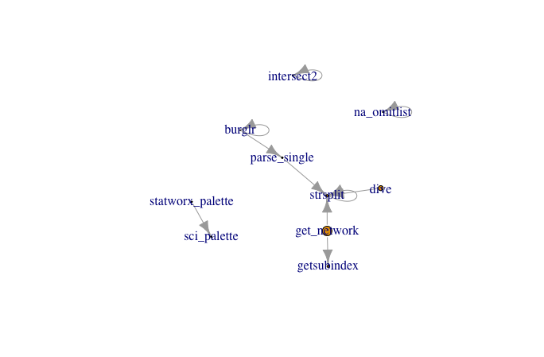

# Flowcharts for R projects

These functions create a flowchart with the conections of R functions within a given path.

If you have questions or suggestions, feel free to contact me either or raise an Issue.


## Installation

The `get_network` function within the [helfRlein]() package is the updated version of `getnetwork.R`.  You can install and use it with

```R
# install.packages("devtools")
devtools::install_github("STATWORX/helfRlein")
```

The `getnetwork` function will stay in its current state, so it is consistent with the [blog article](https://www.statworx.com/de/blog/flowcharts-of-functions).


## Overview

The aim of the function is to visualise the connections between R functions within a project as a flowchart. Herefore, the input a directory path to the function or a list with the functions and the outputs are an adjacency matrix and an `igraph` object. As an example we use [the R folder of the helfRlein package](https://github.com/STATWORX/helfRlein/tree/master/R):

```R
net <- get_network(dir = "R/", simplify = TRUE)
g1 <- net$igraph
plot(g1)
```

The given plots looks like the following. It shows the connections of each functions (arrows) and also the relative size of the functions code (size of the points).



## Input

There are five parameters to interact with the function:

- a path `dir` which shall be searched.
- a character vector `variations` with the function's definition string - 
  the default is `c(" <- function", "<- function", "<-function")`.
- a `pattern` a string with the file suffix - the default is `"\\.R$"`.
- a boolean `simplify` that removes function with no connections from the plot.
- a named list `all_scripts` which is an alternative to  `dir`. This is mainly just used for testing purposes.

For a normal usage it should be enough to provide a path to the project folder.


## Output

As mentioned above, the output consists of an adjacency matrix and an `igraph` object. The matrix contains the number of calls for each function. The `igraph` object has the following properties:

- The names of the functions are used as **label**.
- The numer of lines of each function (without comments and empty one) are saved as the **size**.
- The **folder**'s name of the first folder in the directory. 
- A **color** corresponding to the folder.

With these properties you can improve the network plot given in the [R_network_functions folder](https://github.com/STATWORX/blog/tree/master/flowchart/R_network_functions) for example like this:

```R
library(igraph)
dir <- "flowchart/R_network_functions/"

net <- get_network(dir = dir)
g1 <- net$igraph

# create plots ------------------------------------------------------------
l <- layout_with_fr(g1)
colrs <- rainbow(length(unique(V(g1)$color)))

plot(g1,
     edge.arrow.size=.1,
     edge.width = 5*E(g1)$weight/max(E(g1)$weight),
     vertex.shape="none",
     vertex.label.color=colrs[V(g1)$color],
     vertex.label.color="black",
     vertex.size = 20,
     vertex.color = colrs[V(g1)$color],
     edge.color="steelblue1",
     layout = l)
legend(x=0,
       unique(V(g1)$folder), pch=21,
       pt.bg= colrs[unique(V(g1)$color)],
       pt.cex=2, cex=.8, bty="n", ncol=1)
```


## How does the function work

For more details how the function works you can visit our blog at:
https://www.statworx.com/de/blog/flowcharts-of-functions